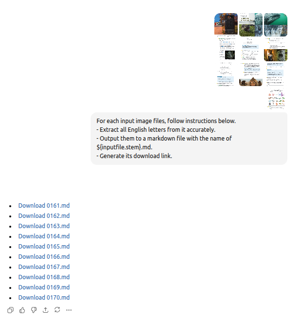

# [AI Image OCR Prompt](https://github.com/europanite/ai_image_ocr_prompt "AI Image OCR Prompt")

[](https://opensource.org/licenses/Apache-2.0)


||
|:-:|

**Um prompt de OCR de imagens com IA**.

# Prompt

Insira seus arquivos de imagem e o texto abaixo.

```markdown
For each input image files, follow instructions below. 
- Extract all English letters from it accurately. 
- Output them to a markdown file with the name of ${inputfile.stem}.md. 
- Generate its download link.
```

---

## Licença
- Apache License 2.0
